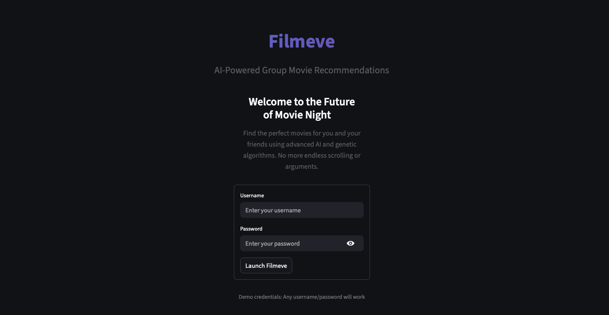
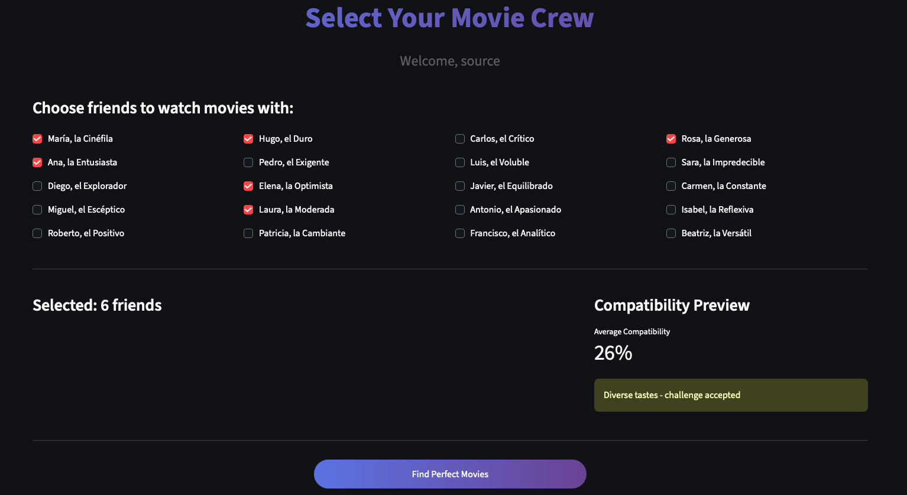
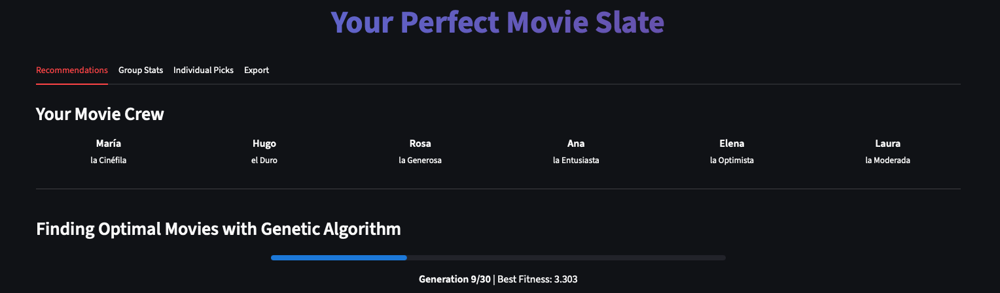
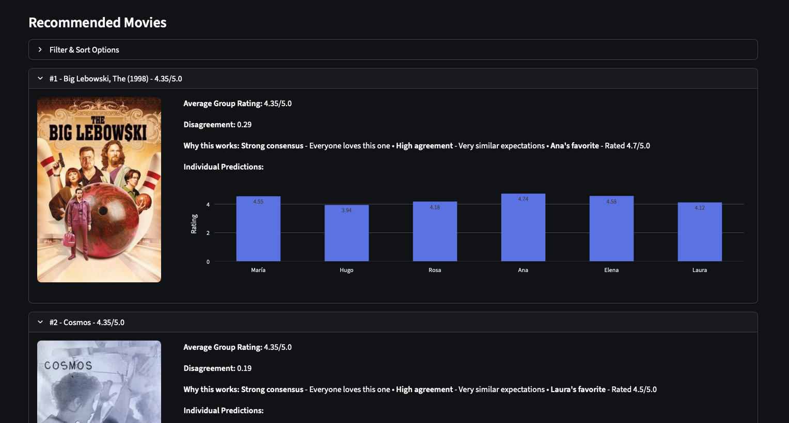
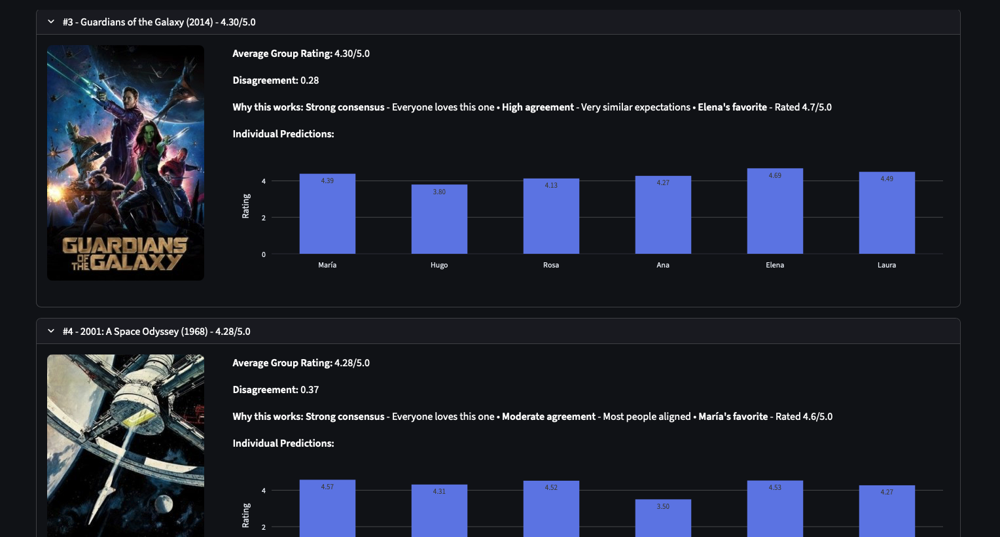
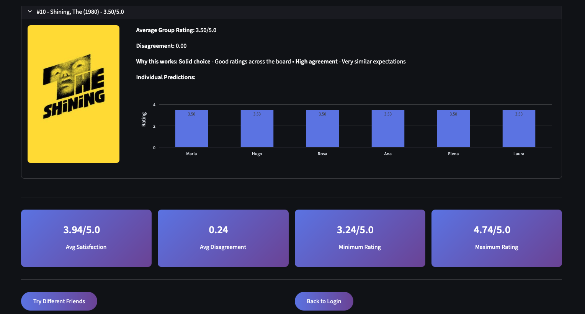
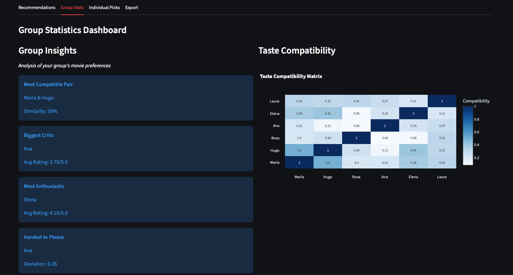
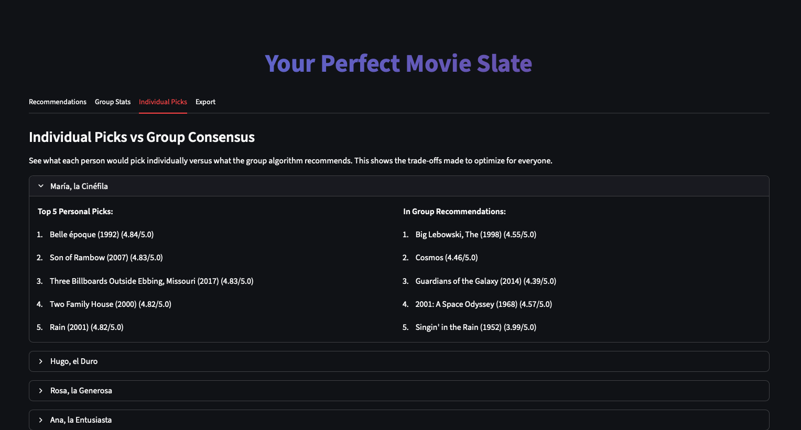
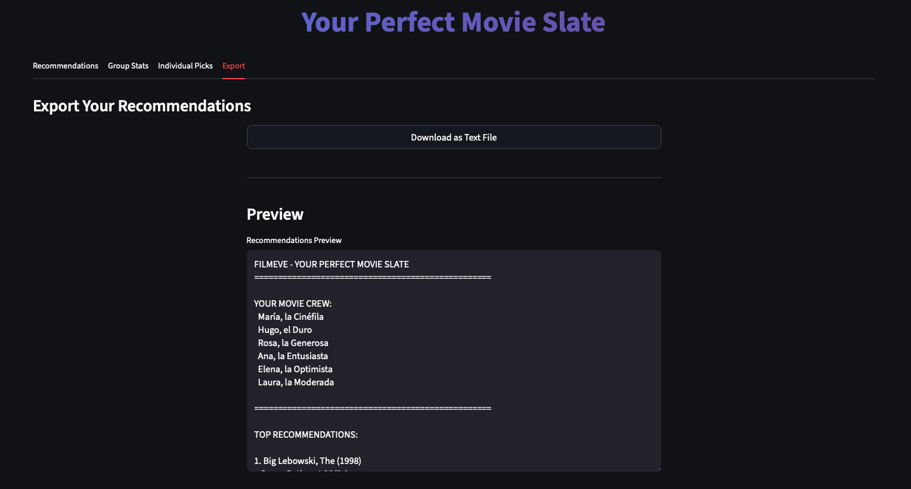

# Filmeve

<h3 align='center'>Bias-Reduced Movie Recommendation System with Genetic Algorithm Optimization</h3>

<!-- Relevant tech stack badges -->
<p align='center'>
    <a href="https://www.python.org"></a>
    <a href="https://streamlit.io"></a>
    <a href="https://scikit-learn.org"></a>
    <a href="https://xgboost.readthedocs.io"></a>
    <a href="https://lightgbm.readthedocs.io"></a>
    <a href="https://catboost.ai"></a>
    <a href="https://pandas.pydata.org"></a>
    <a href="https://numpy.org"></a>
    <a href="https://matplotlib.org"></a>
    <a href="https://seaborn.pydata.org"></a>
</p>

---

## Overview

**Filmeve** is an advanced movie recommendation system that combines bias reduction techniques with genetic algorithm optimization to provide accurate predictions and fair group recommendations.

### Key Innovation

- **Bias Reduction**: Applied 5 winning bias reduction strategies (expectation, cinephile, collaborative, popularity, review_bombing) achieving **+4.31% improvement** over baseline
- **Stacked Ensemble Model**: XGBoost + LightGBM + CatBoost + GradientBoosting with Ridge meta-learner
- **100+ Features**: Comprehensive feature engineering including user preferences, movie metadata, cast/director encoding, and interaction features
- **Genetic Algorithm**: Optimizes movie slates for group satisfaction with 80/20 fitness weighting (satisfaction vs fairness)

### Performance

| Model | Test RMSE | Improvement |
|-------|-----------|-------------|
| **Bias-Reduced (Final)** | **0.6932** | **+4.31%** |
| Baseline (No Bias Reduction) | 0.7244 | - |

---

## Features

### Core Capabilities
- **Bias Reduction**: 10 strategies addressing psychological and statistical biases in user ratings
- **Rating Prediction**: Accurate movie rating predictions using stacked ensemble learning
- **Group Recommendations**: GA-optimized movie slates maximizing group satisfaction
- **Fair Recommendations**: Balanced recommendations ensuring all group members are satisfied

### Technical Highlights
- **TMDB Metadata Enrichment**: Director, cast, budget, revenue, popularity, ratings
- **Feature Engineering**: 106 features including user stats, genre preferences, temporal patterns, financial metrics, and interaction features
- **Production-Ready**: Complete pipeline from data sourcing to model deployment
- **Reproducible**: Seed-controlled experiments with comprehensive evaluation metrics

---

## Installation

### Prerequisites
- **Python 3.11.9** or higher
- **pip** or **uv** package manager

### Setup

1. **Clone the repository**
   ```bash
   git clone https://github.com/yourusername/Filmeve.git
   cd Filmeve
   ```

2. **Create virtual environment**
   ```bash
   python -m venv .venv
   source .venv/bin/activate  # On Windows: .venv\Scripts\activate
   ```

3. **Install dependencies**
   ```bash
   pip install -r requirements.txt
   ```

   Or using `uv` (faster):
   ```bash
   uv pip install -r requirements.txt
   ```

---

## Dataset Setup

### 1. Download MovieLens 100K Dataset

Download the dataset from [GroupLens](https://grouplens.org/datasets/movielens/):

```bash
# Download MovieLens 100K
curl -o ml-latest-small.zip https://files.grouplens.org/datasets/movielens/ml-latest-small.zip

# Extract to data/raw
unzip ml-latest-small.zip -d data/raw/MovieLens_100K/
```

**Manual alternative**: Visit https://grouplens.org/datasets/movielens/ and download "ml-latest-small.zip"

### 2. Decompress large dataset files

Large dataset files are compressed due to GitHub size limits:

```bash
# Decompress all .csv.zip files
cd data/processed
unzip *.csv.zip
cd ../..
```

### 3. (Optional) TMDB Metadata Scraping

If you want to re-scrape TMDB metadata:

1. Get a TMDB API key from https://www.themoviedb.org/settings/api
2. Set environment variable:
   ```bash
   export TMDB_API_KEY="your_api_key_here"
   ```
3. Run scraper:
   ```bash
   python src/tmdb_scraper.py
   ```

---

## Usage

### Training the Model

Train the bias-reduced model with 5 winning strategies:

```bash
python src/train_model.py
```

Or

```bash
uv run src/train_model.py
```


**Options:**
- `--cv-folds N`: Number of cross-validation folds (default: 5)
- `--test-size FLOAT`: Test set size (default: 0.2)

**Test the trained model:**
```bash
uv run src/train_model.py --test
```

### Group Recommendations

Generate recommendations for a group of users:

```bash
uv run src/recommend_for_group.py --users 105,275,357,202,62
```

**Options:**
- `--users USER_IDS`: Comma-separated list of user IDs
- `--slate-size N`: Number of movies to recommend (default: 10)
- `--candidates N`: Candidate pool size (default: 200)

**Test mode (evaluate on discovered groups):**
```bash
uv run src/recommend_for_group.py --test
```

### Streamlit Demo App

Experience Filmeve through an interactive web interface with real-time genetic algorithm visualization.

#### Running the App

**Single instance:**
```bash
cd streamlit_app
uv run streamlit run app.py
```

The app will open in your browser at `http://localhost:8501`

**Multiple instances** (for demos/presentations):
```bash
# Terminal 1
cd streamlit_app
uv run streamlit run app.py --server.port 8501

# Terminal 2
cd streamlit_app
uv run streamlit run app.py --server.port 8502
```

Access at:
- http://localhost:8501
- http://localhost:8502

#### Features

- **Login Interface**: Clean, gradient-styled authentication
- **Friend Selection**: Choose from 20 personality-based users with Spanish nicknames
- **Real-time GA**: Watch the genetic algorithm evolve over 30 generations
- **Movie Recommendations**: Beautiful poster displays with individual ratings
- **Group Analytics**: Compatibility matrix, insights, and statistics
- **Export**: Download recommendations as text file

#### Screenshots

**Login Page**



**Friend Selection**



**Genetic Algorithm Evolution**



**Movie Recommendations with Posters**





**Group Statistics Dashboard**





**Individual Picks Comparison**



**Export Functionality**



See [streamlit_app/README.md](streamlit_app/README.md) for detailed documentation.

### Notebooks

Explore the analysis and development process:

1. **01_data_sourcing.ipynb**: Data loading, TMDB enrichment, cleaning
2. **02_eda.ipynb**: Exploratory data analysis, bias identification
3. **03_training_evaluation.ipynb**: Baseline model training, feature engineering
4. **04_bias_reduction.ipynb**: Bias reduction strategy evaluation
5. **05_ga_group_recommendations.ipynb**: Genetic algorithm optimization

Run notebooks with Jupyter:
```bash
jupyter notebook notebooks/
```

---

## Project Structure

```
Filmeve/
├── data/
│   ├── raw/                        # Raw MovieLens data
│   │   └── MovieLens_100K/
│   ├── processed/                  # Processed datasets
│   │   ├── ratings_enriched.csv    # Ratings + TMDB metadata
│   │   ├── movies_enriched.csv     # Movies + TMDB metadata
│   │   ├── ratings_bias_reduced.csv
│   │   ├── ratings_featured.csv.zip # Precomputed features (compressed)
│   │   └── ratings_featured_bias_reduced.csv
│   └── test/                       # Test groups
├── docs/                           # Documentation
│   ├── img/                        # Screenshots
│   └── bias_reduction_comparison.png
├── models/                         # Trained models
│   ├── model_bias_reduced.pkl      # Final model (106 features)
│   ├── feature_columns_bias_reduced.pkl
│   └── model_bias_reduced_config.yaml
├── notebooks/                      # Jupyter notebooks
│   ├── 01_data_sourcing.ipynb
│   ├── 02_eda.ipynb
│   ├── 03_training_evaluation.ipynb
│   ├── 04_bias_reduction.ipynb
│   └── 05_ga_group_recommendations.ipynb
├── src/                            # Source code
│   ├── bias_reduction.py           # Bias reduction strategies
│   ├── feature_engineering.py      # Feature engineering pipeline
│   ├── train_model.py              # Model training script
│   ├── recommend_for_group.py      # Group recommendation system
│   ├── tmdb_scraper.py             # TMDB metadata scraper
│   ├── clean_data.py               # Data cleaning utilities
│   └── discover_users_diverse.py   # User group discovery
├── streamlit_app/                  # Interactive web demo
│   ├── app.py                      # Main Streamlit application
│   ├── utils.py                    # Helper functions
│   ├── requirements.txt            # Streamlit dependencies
│   └── README.md                   # App documentation
├── results/                        # GA results and visualizations
├── requirements.txt                # Python dependencies
└── README.md
```

---

## Key Results

### Bias Reduction Impact

| Strategy | Test RMSE | Improvement |
|----------|-----------|-------------|
| **expectation** | 0.7020 | +3.09% |
| **cinephile** | 0.7184 | +0.83% |
| **collaborative** | 0.7194 | +0.68% |
| **popularity** | 0.7219 | +0.35% |
| **review_bombing** | 0.7225 | +0.26% |
| **Combined (5 strategies)** | **0.6932** | **+4.31%** |

### Genetic Algorithm Performance

**Steven Spielberg Fans Group** (5 users):
- **Fitness**: 3.700
- **Average Satisfaction**: 4.663 / 5.0 (93.3%)
- **Disagreement**: 0.151 (very low)
- **Individual Scores**: [4.70, 4.84, 4.41, 4.60, 4.77]

**Convergence**: 30 generations (~6 minutes)

---

## Methodology

### Feature Engineering (106 Features)

**User Features (30+):**
- Rating statistics (count, mean, std, range, median)
- Genre preferences (20 genres)
- Director/country/genre diversity

**Movie Features (40+):**
- Temporal (release year, age, decade, recency)
- Financial (budget, revenue, ROI, profit)
- Popularity (vote count, TMDB ratings, engagement)
- Genre encoding (20 binary indicators)

**Cast & Director Features (15+):**
- Target-encoded director quality
- Lead actor average ratings
- Cast ensemble ratings

**Interaction Features (10+):**
- User-genre match scores
- Rating deviations from expectations
- Activity and popularity ratios

### Bias Reduction Strategies

1. **Expectation Bias**: Adjusts for rating inflation based on TMDB expectations
2. **Cinephile Adjustment**: Corrects harsh ratings from film critics
3. **Collaborative Debiasing**: Uses similar users' patterns to normalize ratings
4. **Popularity Bias**: Downweights artificially inflated blockbuster ratings
5. **Review Bombing**: Detects and adjusts coordinated negative rating campaigns

### Genetic Algorithm

**Fitness Function:**
```
fitness = 0.8 × satisfaction - 0.2 × disagreement
```
- **80% weight** on average user satisfaction
- **20% weight** on fairness (low disagreement)

**Operators:**
- **Selection**: Tournament selection (size=3)
- **Crossover**: Order crossover (preserves movie ordering)
- **Mutation**: Replacement mutation (swaps movie with candidate from pool)
- **Elitism**: Top 10 slates preserved each generation

---

## Dependencies

Core libraries:
- **scikit-learn**: Ensemble models, evaluation metrics
- **xgboost**: Gradient boosting framework
- **lightgbm**: Fast gradient boosting
- **catboost**: Categorical feature handling
- **pandas**: Data manipulation
- **numpy**: Numerical operations
- **matplotlib/seaborn**: Visualization
- **tqdm**: Progress bars
- **joblib**: Model serialization
- **pyyaml**: Configuration files

Full list in `requirements.txt`

---

## License

MIT License

Copyright (c) 2025 Filmeve

Permission is hereby granted, free of charge, to any person obtaining a copy
of this software and associated documentation files (the "Software"), to deal
in the Software without restriction, including without limitation the rights
to use, copy, modify, merge, publish, distribute, sublicense, and/or sell
copies of the Software, and to permit persons to whom the Software is
furnished to do so, subject to the following conditions:

The above copyright notice and this permission notice shall be included in all
copies or substantial portions of the Software.

THE SOFTWARE IS PROVIDED "AS IS", WITHOUT WARRANTY OF ANY KIND, EXPRESS OR
IMPLIED, INCLUDING BUT NOT LIMITED TO THE WARRANTIES OF MERCHANTABILITY,
FITNESS FOR A PARTICULAR PURPOSE AND NONINFRINGEMENT. IN NO EVENT SHALL THE
AUTHORS OR COPYRIGHT HOLDERS BE LIABLE FOR ANY CLAIM, DAMAGES OR OTHER
LIABILITY, WHETHER IN AN ACTION OF CONTRACT, TORT OR OTHERWISE, ARISING FROM,
OUT OF OR IN CONNECTION WITH THE SOFTWARE OR THE USE OR OTHER DEALINGS IN THE
SOFTWARE.

---

## Acknowledgments

- **MovieLens Dataset**: [GroupLens Research](https://grouplens.org/datasets/movielens/)
- **TMDB API**: [The Movie Database](https://www.themoviedb.org/)
- **scikit-learn**: Machine learning framework
- **XGBoost, LightGBM, CatBoost**: Gradient boosting implementations

---

## Contact

For questions, suggestions, or collaborations, please open an issue or contact the maintainers.

---

**Built with Python and Machine Learning**
